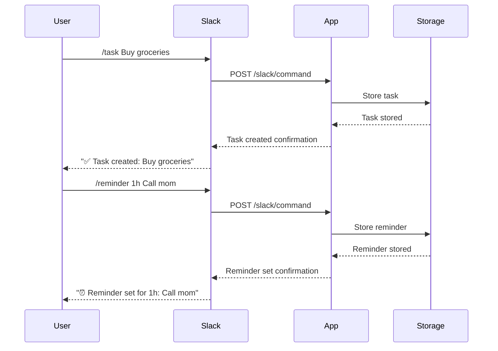

# Slack Task Manager

A Slack bot application for managing tasks and reminders through slash commands. Built with TypeScript and Motia framework.

## Features

- Create tasks with `/task` command
- Set reminders with `/reminder` command
- Mark tasks as complete with `/complete` command
- List all your tasks with `/list` command

## Prerequisites

- Node.js (v16 or higher)
- pnpm package manager
- Slack workspace with admin access
- ngrok (for local development)

## Setup Instructions

### 1. Local Development Setup

```bash
# Clone the repository
git clone https://github.com/swarna1101/slack-task-manager.git
cd slack-task-manager

# Install dependencies
pnpm install

# Create .env file with Slack tokens
echo "SLACK_VERIFICATION_TOKEN=your_verification_token
SLACK_BOT_TOKEN=your_bot_token" > .env

# Start development server
pnpm run dev

# In a separate terminal, start ngrok
ngrok http 3000
```

### 2. Slack App Configuration

1. Go to [Slack API Dashboard](https://api.slack.com/apps)
2. Create a new app
3. Configure slash commands:
   - `/task` - Create a new task
   - `/reminder` - Set a reminder
   - `/complete` - Mark a task as complete
   - `/list` - List your tasks
4. Set the Request URL to your ngrok URL + `/slack/command`
5. Add bot token scopes:
   - `chat:write`
   - `commands`
6. Install the app to your workspace

## Environment Variables

```env
SLACK_VERIFICATION_TOKEN=your_verification_token
SLACK_BOT_TOKEN=your_bot_token
```

## Available Commands

### Create a Task
```
/task Buy groceries
```

### Set a Reminder
```
/reminder 1h Call mom
```
Time formats supported:
- `1h` (1 hour)
- `30m` (30 minutes)
- `2d` (2 days)
- `1w` (1 week)

### Complete a Task
```
/complete Buy groceries
```

### List Tasks
```
/list
```

## Architecture

The application follows a modular architecture with separate steps for different functionalities:

- `api.step.ts` - Handles Slack slash commands and API endpoints
- `taskStorage.step.ts` - Manages task storage and state
- `reminder.step.ts` - Handles reminder scheduling and notifications

## Sequence Diagram



## Known Issues

1. **Token Verification**: The app currently uses a simple token verification. Consider implementing Slack's recommended signature verification for better security.
2. **In-Memory Storage**: Tasks are stored in memory and will be lost on server restart. Consider implementing persistent storage.
3. **Error Handling**: Some error cases might not be properly handled. Need to improve error messages and logging.

## Future Improvements

1. **Persistent Storage**:
   - Implement database integration (MongoDB/PostgreSQL)
   - Add data persistence
   - Add task history

2. **Enhanced Features**:
   - Task categories and tags
   - Recurring reminders
   - Task assignments to team members
   - Task priorities
   - Due dates

3. **UI Improvements**:
   - Interactive message buttons
   - Rich message formatting
   - Task status updates
   - Progress tracking

4. **Security**:
   - Implement proper Slack signature verification
   - Add rate limiting
   - Add user authentication

5. **Testing**:
   - Add unit tests
   - Add integration tests
   - Add CI/CD pipeline

## Contributing

1. Fork the repository
2. Create a feature branch
3. Commit your changes
4. Push to the branch
5. Create a Pull Request

## License

MIT License - See LICENSE file for details

## Support

For support, please open an issue in the GitHub repository. 