# Slack Task Manager

A comprehensive Slack bot application for managing tasks and reminders through slash commands. Built with TypeScript and Motia framework, this application provides an intuitive way to manage tasks and set reminders directly from Slack.

## Features

🤖 **Task Management**
- Create tasks with `/task` command
- Mark tasks as complete with `/complete` command
- List all your tasks with `/list` command
- View task history and status

⏰ **Smart Reminders**
- Set reminders with `/reminder` command
- Flexible time formats (hours, minutes, days, weeks)
- Customizable reminder messages
- Reminder notifications in channels

🔄 **Real-time Updates**
- Instant task creation confirmation
- Immediate status updates
- Channel-wide notifications
- User-specific task lists

## Prerequisites

- Node.js (v16 or higher)
- pnpm package manager
- Slack workspace with admin access
- ngrok (for local development)
- Slack API credentials

## Setup

### 1. Local Development Setup

```bash
# Clone the repository
git clone https://github.com/swarna1101/slack-task-manager.git
cd slack-task-manager

# Install dependencies
pnpm install

# Create .env file with Slack tokens
cp .env.example .env
```

### 2. Environment Configuration

Configure the following environment variables in the `.env` file:

```env
SLACK_VERIFICATION_TOKEN=your_verification_token
SLACK_BOT_TOKEN=your_bot_token
```

### 3. Setting up ngrok for Local Development

#### Why ngrok?
ngrok is essential for local development because:
1. **Public URL for Local Server**: Slack needs to send webhook requests to your application, but it can't reach `localhost` directly. ngrok creates a public URL that forwards to your local server.
2. **Real-time Testing**: You can test your Slack app in real-time without deploying to a production server.
3. **Request Inspection**: ngrok provides a web interface (http://127.0.0.1:4040) where you can inspect all incoming requests and responses.
4. **Temporary Solution**: Perfect for development and testing, though not recommended for production use.

#### Installation Options:
```bash
# Using Homebrew (macOS)
brew install ngrok

# Using npm
npm install -g ngrok

# Using direct download
# Visit https://ngrok.com/download and download for your OS
```

#### Starting ngrok:
1. Start your development server:
   ```bash
   pnpm run dev
   ```

2. In a new terminal, start ngrok:
   ```bash
   ngrok http 3000
   ```

3. You'll see output like this:
   ```
   Session Status                online
   Account                       Your Account
   Version                       3.x.x
   Region                       United States (us)
   Web Interface                http://127.0.0.1:4040
   Forwarding                   https://xxxx-xx-xx-xxx-xx.ngrok-free.app -> http://localhost:3000
   ```

4. Copy the `Forwarding` URL (e.g., `https://xxxx-xx-xx-xxx-xx.ngrok-free.app`)

#### Understanding ngrok Output:
- **Session Status**: Shows if ngrok is running properly
- **Web Interface**: Local dashboard to inspect requests (http://127.0.0.1:4040)
- **Forwarding**: The public URL that forwards to your local server
- **Region**: The server region handling your requests
- **Version**: Your ngrok version

#### Important Notes:
1. The free tier of ngrok:
   - Provides random URLs that change on each restart
   - Has some rate limiting
   - Sessions expire after a few hours
2. For production:
   - Consider using a paid ngrok account for fixed URLs
   - Or deploy to a proper hosting service

### 4. Slack App Configuration

1. Go to [Slack API Dashboard](https://api.slack.com/apps)
2. Create a new app
3. Configure slash commands:
   - `/task` - Create a new task
   - `/reminder` - Set a reminder
   - `/complete` - Mark a task as complete
   - `/list` - List your tasks
4. For each command, set the Request URL to your ngrok URL + `/slack/command`
   Example: `https://xxxx-xx-xx-xxx-xx.ngrok-free.app/slack/command`
5. Add bot token scopes:
   - `chat:write`
   - `commands`
6. Install the app to your workspace

### 5. Testing Your Setup

1. Make sure your development server is running (`pnpm run dev`)
2. Keep ngrok running in a separate terminal
3. Try the commands in Slack:
   ```
   /task Test task
   /reminder 1h Test reminder
   ```

### Troubleshooting

1. **ngrok URL changes**: If you restart ngrok, you'll get a new URL. You'll need to update the Request URLs in your Slack app settings.

2. **Connection issues**:
   - Ensure your development server is running on port 3000
   - Check that ngrok is forwarding to the correct port
   - Verify the Request URLs in Slack app settings match your ngrok URL

3. **Command not working**:
   - Check the development server logs for errors
   - Verify your environment variables are set correctly
   - Ensure the Slack app is installed to your workspace

## Development

Start the development server:
```bash
pnpm run dev
```

For debugging:
```bash
pnpm run dev:debug
```

## Project Structure

```
├── steps/
│   ├── api.step.ts         # Slack command handlers
│   ├── taskStorage.step.ts # Task storage management
│   └── reminder.step.ts    # Reminder scheduling
├── .env                    # Environment variables
├── vite.config.ts         # Vite configuration
└── package.json           # Project dependencies
```

## How It Works

### Under the Hood: Command Processing

#### 1. Task Creation Flow (`/task`)

```mermaid
sequenceDiagram
    participant User
    participant Slack
    participant App
    participant Storage
    participant Logger

    User->>Slack: /task Buy groceries
    Slack->>App: POST /slack/command
    Note over App: 1. Request received
    App->>Logger: Log request details
    Note over Logger: [INFO] Received Slack command
    App->>App: Verify Slack token
    Note over App: 2. Token verification
    App->>Logger: Log verification status
    Note over Logger: [INFO] Token verification
    App->>Storage: Store task
    Note over Storage: 3. Task stored in memory
    Storage-->>App: Task stored
    App-->>Slack: Task created confirmation
    Slack-->>User: "✅ Task created: Buy groceries"
```


#### 2. Reminder Flow (`/reminder`)


### Detailed Process Flow

#### 1. Request Reception
```typescript
// When a command is received
logger.info('Received Slack command:', {
  headers: req.headers,
  body: req.body
});
```
- Slack sends a POST request to `/slack/command`
- Request includes command, text, user_id, channel_id
- Headers contain verification tokens

#### 2. Token Verification
```typescript
const slackToken = process.env.SLACK_VERIFICATION_TOKEN;
const requestToken = req.headers['x-slack-request-token'] || req.headers['x-slack-signature'];
logger.info('Token verification:', {
  hasSlackToken: !!slackToken,
  requestToken: requestToken
});
```
- Verifies request authenticity
- Checks against environment variables
- Logs verification status

#### 3. Command Processing
```typescript
switch (body.command) {
  case '/task':
    const taskData = {
      topic: 'task_created',
      data: {
        text: body.text,
        user: body.user_id,
        channel: body.channel_id,
        timestamp: new Date().toISOString(),
      }
    };
```
- Parses command type
- Extracts relevant information
- Prepares data structure

#### 4. Storage Operations
```typescript
const tasks: Array<{
  id: string;
  text: string;
  user: string;
  channel: string;
  status: 'pending' | 'completed';
  createdAt: string;
}> = [];
```
- In-memory array storage
- Task structure with metadata
- Status tracking

#### 5. Response Generation
```typescript
return {
  status: 200,
  body: {
    response_type: 'in_channel',
    text: `✅ Task created: ${body.text}`,
  },
};
```
- Formats response
- Sets response type
- Includes emoji indicators

### Logging and Debugging

The application includes comprehensive logging:

1. **Request Logging**
   ```
   [INFO] Received Slack command:
   {
     headers: {...},
     body: {
       command: '/task',
       text: 'Buy groceries',
       user_id: 'U123456',
       channel_id: 'C123456'
     }
   }
   ```

2. **Token Verification**
   ```
   [INFO] Token verification:
   {
     hasSlackToken: true,
     requestToken: '...'
   }
   ```

3. **Error Handling**
   ```
   [ERROR] Error processing Slack command:
   {
     message: 'Invalid token',
     stack: '...'
   }
   ```

### Performance Considerations

1. **Memory Usage**
   - In-memory storage is efficient for development
   - Consider database for production
   - Regular cleanup of completed tasks

2. **Response Time**
   - Average response time: < 100ms
   - Token verification adds minimal overhead
   - In-memory operations are fast

3. **Scalability**
   - Current implementation is single-instance
   - Memory storage limits scalability
   - Consider distributed storage for production

## Current Implementation Details

### Task Storage
- In-memory storage using array
- Task structure:
  ```typescript
  {
    id: string;
    text: string;
    user: string;
    channel: string;
    status: 'pending' | 'completed';
    createdAt: string;
  }
  ```

### Command Processing
- Token verification using `SLACK_VERIFICATION_TOKEN`
- Command parsing and validation
- Error handling and logging
- Response formatting

### Known Issues and Limitations

1. **Token Verification**
   - Current: Simple token matching
   - Issue: Not using Slack's recommended signature verification
   - Impact: Potential security vulnerabilities
   - Workaround: Implement proper signature verification

2. **Storage Limitations**
   - Current: In-memory storage
   - Issue: Data loss on server restart
   - Impact: Tasks and reminders are not persistent
   - Workaround: Use database storage

3. **Error Handling**
   - Current: Basic error catching
   - Issue: Generic error messages
   - Impact: Difficult to debug issues
   - Workaround: Implement detailed error logging

4. **Reminder System**
   - Current: Basic time parsing
   - Issue: Limited time format support
   - Impact: User experience limitations
   - Workaround: Add more time format options

## Future Improvements

1. **Persistent Storage**
   - [ ] MongoDB integration
   - [ ] PostgreSQL support
   - [ ] Data migration tools
   - [ ] Backup system

2. **Enhanced Features**
   - [ ] Task categories and tags
   - [ ] Recurring reminders
   - [ ] Team member assignments
   - [ ] Task priorities
   - [ ] Due dates
   - [ ] Task dependencies

3. **UI Improvements**
   - [ ] Interactive buttons
   - [ ] Rich message formatting
   - [ ] Status updates
   - [ ] Progress tracking
   - [ ] Custom emojis

4. **Security Enhancements**
   - [ ] Slack signature verification
   - [ ] Rate limiting
   - [ ] User authentication
   - [ ] Audit logging

5. **Testing Infrastructure**
   - [ ] Unit tests
   - [ ] Integration tests
   - [ ] E2E tests
   - [ ] CI/CD pipeline
   - [ ] Performance testing


